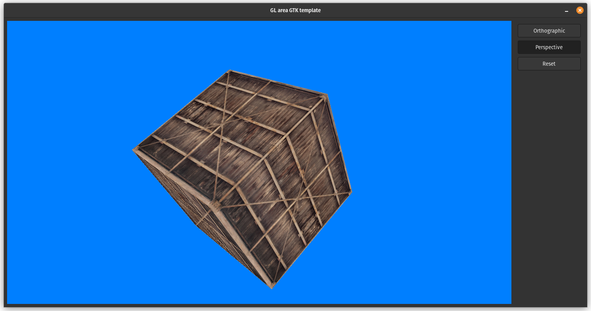

# Gtkmm OpenGL Template

This is a [Gtkmm (GTK C++ interface)](https://gtkmm.org/en/index.html) application template which can be used for building tools that require an OpenGL context (2D or 3D).

A few basic elements have been implemented and more will be added when time permits.

Contributions are welcome! ❤️

---

---

### Implemented elements
- Mouse callbacks: pointer and scroll

- Keyboard callbacks: key presses
    - (Un) fullscreen: F11

- Cameras: 
    - Orthographic and perspective
    - Zoom in/out (including zoom to pointer focus)
    - Reset position

---

### Current focus

- Update the Makefile to develop on Linux, MacOS, and Windows
- Sync the zoom distance for both camera projections
- Panning controls for the camera